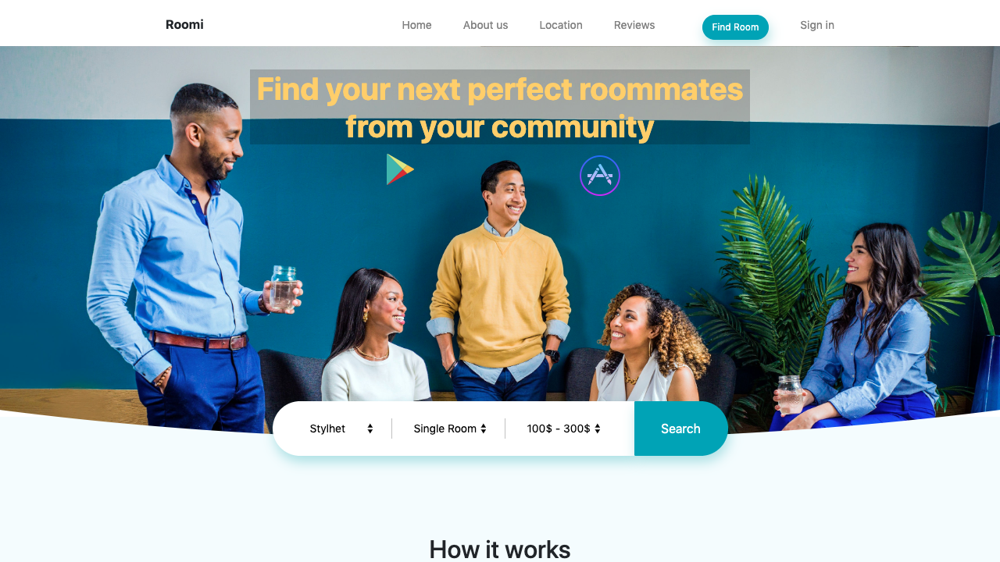

# Perfect Roommate.
> Find the perfect roommate to share a home with.

Perfect Roommate is a UI implementation for a web app used to find people to share your apartment with.

## Built With

- HTML, CSS/Sass,
- Bootstrap,
- Media queries, flexbox

## Live Demo

[Live Demo Link](https://perfectrommate.netlify.com/)

## Getting Started

To get a local copy up and running follow these simple example steps.

### Setup
clone this repo from:
`https://github.com/SunnyAsar/perfect-roommate`

### Usage
  find the `index.html` file and open with any browser of your choice.

## Authors

👤 **Author**

- Github: [@SunnyAsar](https://github.com/SunnyAsar)
- Twitter: [@sunny_asar](https://twitter.com/sunny_asar)
- Linkedin: [Sunny Asar](https://www.linkedin.com/in/sunnyasar/)

## 🤝 Contributing

Contributions, issues and feature requests are welcome!

Feel free to check the [issues page](https://github.com/SunnyAsar/perfect-roommate/issues).

## Show your support

Give a ⭐️ if you like this project!

## Acknowledgments

- Hat tip to anyone whose code was used
- Inspiration
- etc

## 📝 License

This project is [MIT](lic.url) licensed.
